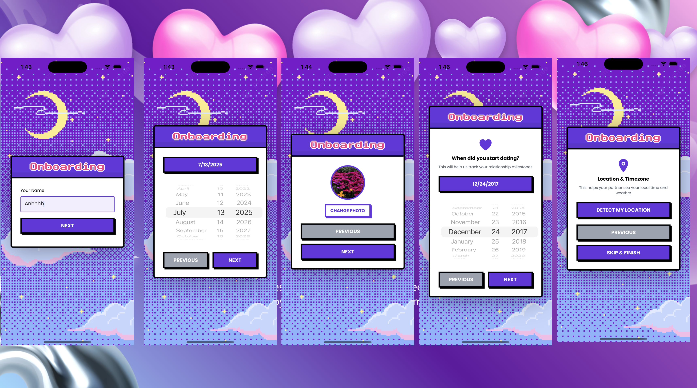

<!-- PROJECT LOGO -->
<br />
<div align="center">
  <a href="https://github.com/othneildrew/Best-README-Template">
    
  </a>
  <p align="center">
    <a href="https://github.com/ThanhDatVu111/0-KM/issues">Report Bug</a>
    ·
    <a href=https://github.com/ThanhDatVu111/0-KM/pulls>Request Feature</a>
    
  </p>
</div>

<!-- TABLE OF CONTENTS -->
<details>
  <summary>🗂️ Table of Contents</summary>
  <ol>
    <li><a href="#-about-the-project">About The Project</a>
      <ul>
        <li><a href="#-authentication">Authentication</a></li>
        <li><a href="#-onboarding">Onboarding</a></li>
        <li><a href="#-room-pairing">Room Pairing</a></li>
        <li><a href="#-home-page">Home Page</a></li>
        <li><a href="#-profile">Profile</a></li>
        <li><a href="#-library">Library</a></li>
        <li><a href="#-entries">Entries</a></li>
        <li><a href="#-real-time-chat">Real-time Chat</a></li>
        <li><a href="#-google-calendar-integration">Google Calendar Integration</a></li>
        <li><a href="#-database-structure">Database Structure</a></li>
      </ul>
    </li>
    <li><a href="#%EF%B8%8F-tech-stack">Tech Stack</a></li>
    <li><a href="#-getting-started">Getting Started</a>
      <ul>
        <li><a href="#-prerequisites">Prerequisites</a></li>
        <li><a href="#%EF%B8%8F-installation">Installation</a></li>
        <li><a href="#-configuration-steps">Configuration Steps</a></li>
      </ul>
    </li>
    <li><a href="#-contributing">Contributing</a></li>
    <li><a href="#-team">Team</a></li>
    <li><a href="#-license">License</a></li>
    <li><a href="#-contact">Contact</a></li>
  </ol>
</details>

<!-- ABOUT THE PROJECT -->

## � About The Project

0-KM is a mobile app designed to help couples stay connected across any distance. Built with modern technologies, it offers a comprehensive platform for relationship building and maintenance.

### 🔐 Authentication


_Sign up and login with email or Google OAuth_

Our secure authentication system provides:

- Email and password sign-up/sign-in
- Google OAuth integration
- Secure session management with Clerk
- Email verification process
- Forgot password functionality

### Onboarding


_Smooth onboarding experience for new users_

Smooth onboarding experience includes:

- User profile creation
- Partner information setup
- Relationship preferences configuration
- Getting started guide

### 👫 Room Pairing


_Secure couple workspace creation and joining_

Unique pairing system features:

- Secure room creation and joining
- Partner verification process
- Private couple workspace establishment
- Synchronized user experience

### 🏠 Home Page


_Main dashboard with relationship milestones and quick access_

The main dashboard provides:

- Relationship milestones tracking
- Quick access to all features
- Personalized content feed
- Activity overview

### 👤 Profile


_Profile management - logout, leave room, and see partner details_

Comprehensive profile management:

- Personal information editing
- Relationship status updates
- Account settings
- Privacy controls
- Logout functionality
- Leave room option
- Partner information viewing

### 📚 Library


_Shared digital book collection and reading tracking_

Shared digital library includes:

- Book collection management
- Reading progress tracking
- Shared reading experiences
- Book recommendations

### 📝 Entries


_Interactive journaling and memory documentation_

Interactive journaling system:

- Personal diary entries
- Shared memories documentation
- Photo, video, location and text entries
- Timeline organization
- Leaflet map integration for location-based memories
- Pagination fetch
- Cloudinary integration for media storage
- Dynamic photo + video grid

### Real-time Chat


_Advanced messaging platform for couples_

Advanced messaging platform features:

- Instant messaging
- Media sharing (photos, videos)
- Message history
- Push notifications
- Online/offline status

### Google Calendar Integration


_Calendar synchronization for couples_

Calendar synchronization includes:

- Google Calendar connection
- Mutual availability viewing
- Event scheduling
- Virtual date planning
- Calendar conflict resolution

### 💾 Database Structure


_Sustainable and scalable data architecture_

Robust data architecture using:

- 8 tables
- Supabase for structured data
- Real-time data synchronization
- Secure data management
- Efficient querying system

<p align="right">(<a href="#readme-top">back to top</a>)</p>

## 🛠️ Tech Stack

This project is built using modern technologies to ensure performance and scalability.

### Frontend

[![React Native][React-Native.js]][React-Native-url]
[![Expo][Expo.dev]][Expo-url]
[![TypeScript][TypeScript.ts]][TypeScript-url]
[![Tailwind CSS][Tailwind.css]][Tailwind-url]
[![NativeWind][NativeWind.dev]][NativeWind-url]

### Backend

[![Node.js][Node.js]][Node-url]
[![Express][Express.js]][Express-url]
[![TypeScript][TypeScript.ts]][TypeScript-url]
[![Socket.io][Socket.io]][Socket-url]

### Authentication & Database

[![Clerk][Clerk.dev]][Clerk-url]
[![Supabase][Supabase.com]][Supabase-url]
[![PostgreSQL][PostgreSQL.org]][PostgreSQL-url]

### Services & APIs

[![Google Calendar API][Google.calendar]][Google-calendar-url]
[![Cloudinary][Cloudinary.com]][Cloudinary-url]
[![Socket.io][Socket.io]][Socket-url]
[![Leaflet][Leaflet.js]][Leaflet-url]
[![Expo AV][Expo.av]][Expo-av-url]
[![Expo Notifications][Expo.notifications]][Expo-notifications-url]

<!-- MARKDOWN LINKS & BADGES -->

[React-Native.js]: https://img.shields.io/badge/React_Native-20232A?style=for-the-badge&logo=react&logoColor=61DAFB
[React-Native-url]: https://reactnative.dev/
[Expo.dev]: https://img.shields.io/badge/Expo-000020?style=for-the-badge&logo=expo&logoColor=white
[Expo-url]: https://expo.dev/
[TypeScript.ts]: https://img.shields.io/badge/TypeScript-007ACC?style=for-the-badge&logo=typescript&logoColor=white
[TypeScript-url]: https://www.typescriptlang.org/
[Tailwind.css]: https://img.shields.io/badge/Tailwind_CSS-38B2AC?style=for-the-badge&logo=tailwind-css&logoColor=white
[Tailwind-url]: https://tailwindcss.com/
[NativeWind.dev]: https://img.shields.io/badge/NativeWind-38B2AC?style=for-the-badge&logo=tailwindcss&logoColor=white
[NativeWind-url]: https://www.nativewind.dev/
[Node.js]: https://img.shields.io/badge/Node.js-43853D?style=for-the-badge&logo=node.js&logoColor=white
[Node-url]: https://nodejs.org/
[Express.js]: https://img.shields.io/badge/Express.js-404D59?style=for-the-badge&logo=express&logoColor=white
[Express-url]: https://expressjs.com/
[Socket.io]: https://img.shields.io/badge/Socket.io-black?style=for-the-badge&logo=socket.io&badgeColor=010101
[Socket-url]: https://socket.io/
[Clerk.dev]: https://img.shields.io/badge/Clerk-6C47FF?style=for-the-badge&logo=clerk&logoColor=white
[Clerk-url]: https://clerk.com/
[Supabase.com]: https://img.shields.io/badge/Supabase-3ECF8E?style=for-the-badge&logo=supabase&logoColor=white
[Supabase-url]: https://supabase.com/
[PostgreSQL.org]: https://img.shields.io/badge/PostgreSQL-316192?style=for-the-badge&logo=postgresql&logoColor=white
[PostgreSQL-url]: https://www.postgresql.org/
[Google.calendar]: https://img.shields.io/badge/Google_Calendar-4285F4?style=for-the-badge&logo=google-calendar&logoColor=white
[Google-calendar-url]: https://developers.google.com/calendar
[Cloudinary.com]: https://img.shields.io/badge/Cloudinary-3448C5?style=for-the-badge&logo=cloudinary&logoColor=white
[Cloudinary-url]: https://cloudinary.com/
[Leaflet.js]: https://img.shields.io/badge/Leaflet-199900?style=for-the-badge&logo=leaflet&logoColor=white
[Leaflet-url]: https://leafletjs.com/
[Expo.av]: https://img.shields.io/badge/Expo_AV-000020?style=for-the-badge&logo=expo&logoColor=white
[Expo-av-url]: https://docs.expo.dev/versions/latest/sdk/av/
[Expo.notifications]: https://img.shields.io/badge/Expo_Notifications-000020?style=for-the-badge&logo=expo&logoColor=white
[Expo-notifications-url]: https://docs.expo.dev/versions/latest/sdk/notifications/

<p align="right">(<a href="#readme-top">back to top</a>)</p>

<!-- GETTING STARTED -->

## 🚀 Getting Started

To get a local copy up and running, follow these simple steps.

### 📋 Prerequisites

- Node.js (v16.0.0 or higher)
- npm (v7.0.0 or higher)
- Git
- Expo CLI
- ngrok (for exposing local backend to mobile device)
- iOS Simulator (for iOS development) or Android Emulator (for Android development)

### 🛠️ Installation

1. **Create required accounts and get API keys:**
   - [Clerk Account](https://clerk.com) - For authentication
   - [Supabase Account](https://supabase.com) - For database
   - [Google Cloud Console](https://console.cloud.google.com) - For Calendar API
   - [Cloudinary Account](https://cloudinary.com) - For media storage
   - [ngrok Account](https://ngrok.com) - For exposing local backend to mobile devices

2. **Clone the repository:**

   ```sh
   git clone https://github.com/ThanhDatVu111/0-KM.git
   cd 0km-app
   ```

3. **Install dependencies:**

   ```sh
   # Install root dependencies
   npm install

   # Or install separately
   cd frontend
   npm install

   cd ../backend
   npm install
   ```

4. **Configure Environment Variables:**

   ```sh
   # Copy environment files
   cp frontend/.env.example frontend/.env
   cp backend/.env.example backend/.env
   ```

5. **Set up your environment variables:**

   **Frontend (.env):**

   ```env
   EXPO_PUBLIC_CLERK_PUBLISHABLE_KEY=your_clerk_key
   EXPO_PUBLIC_API_HOST=localhost
   EXPO_PUBLIC_API_PORT=3001
   EXPO_PUBLIC_API_PUBLIC_URL=https://your-ngrok-url.ngrok-free.app
   EXPO_PUBLIC_CLOUDINARY_CLOUD_NAME=your_cloudinary_name
   EXPO_PUBLIC_CLOUDINARY_API_KEY=your_cloudinary_key
   EXPO_PUBLIC_CLOUDINARY_SIGN_URL=https://your-ngrok-url.ngrok-free.app/cloudinary-sign
   EXPO_PUBLIC_WEB_CLIENT_ID=your_google_web_client_id
   EXPO_PUBLIC_IOS_CLIENT_ID=your_google_ios_client_id
   EXPO_PUBLIC_CLIENT_SECRET=your_google_client_secret
   EXPO_PUBLIC_SUPABASE_URL=your_supabase_url
   EXPO_PUBLIC_SUPABASE_ANON_KEY=your_supabase_anon_key
   ```

   **Backend (.env):**

   ```env
   PORT=3001
   NGROK_URL=https://your-ngrok-url.ngrok-free.app
   SUPABASE_URL=your_supabase_url
   SUPABASE_SERVICE_ROLE_KEY=your_supabase_service_key
   CLERK_SECRET_KEY=your_clerk_secret_key
   ```

6. **Set up your Supabase database:**
   - Create tables for users, rooms, chats, library, etc.
   - Set up authentication policies
   - Configure real-time subscriptions

7. **Start the development servers:**

   **First, start ngrok to expose your backend:**

   ```sh
   # Install ngrok if you haven't already
   npm install -g ngrok

   # Start ngrok tunnel for port 3001
   ngrok http 3001
   ```

   Copy the ngrok URL (e.g., `https://abc123.ngrok-free.app`) and update your environment variables.

   **Backend:**

   ```sh
   cd backend
   npm run dev
   ```

   **Frontend:**

   ```sh
   cd frontend
   npx expo start --clear
   ```

8. **Run on device:**
   - Scan QR code with Expo Go app (iOS/Android)
   - Or press `i` for iOS simulator
   - Or press `a` for Android emulator

<p align="right">(<a href="#readme-top">back to top</a>)</p>

## 🔧 Configuration Steps

### 1. Clerk Setup

- Create a new application in Clerk Dashboard
- Configure authentication methods (Email, Google OAuth)
- Add your application's domain to allowed origins
- Set up webhook endpoints for user management

### 2. Supabase Setup

- Create a new Supabase project
- Set up database tables using provided SQL schemas
- Configure Row Level Security (RLS) policies
- Enable real-time subscriptions for chat functionality

### 3. Google Calendar API Setup

- Create a project in Google Cloud Console
- Enable Calendar API
- Configure redirect URIs

### 4. Cloudinary Setup

- Create a Cloudinary account
- Get your cloud name and API credentials
- Configure upload presets for media files
- Set up transformation settings

### 5. ngrok Setup

- Create a free ngrok account at [ngrok.com](https://ngrok.com)
- Install ngrok: `npm install -g ngrok`
- Authenticate: `ngrok config add-authtoken YOUR_AUTHTOKEN`
- Start tunnel: `ngrok http 3001`
- Copy the HTTPS URL and update your environment variables
- **Important**: Update both frontend and backend .env files with the ngrok URL

<p align="right">(<a href="#readme-top">back to top</a>)</p>

<!-- CONTRIBUTING -->

## 🤝 Contributing

Contributions are what make the open source community such an amazing place to learn, inspire, and create. Any contributions you make are **greatly appreciated**.

If you have a suggestion that would make this better, please fork the repo and create a pull request. You can also simply open an issue with the tag "enhancement".
Don't forget to give the project a star! Thanks again!

1. Fork the Project
2. Create your Feature Branch (`git checkout -b feature/AmazingFeature`)
3. Commit your Changes (`git commit -m 'Add some AmazingFeature'`)
4. Push to the Branch (`git push origin feature/AmazingFeature`)
5. Open a Pull Request

<p align="right">(<a href="#readme-top">back to top</a>)</p>

<!-- TEAM -->

## 👥 Team

Meet the talented team behind 0-KM:

### 🎯 Project Leadership

<table>
  <tr>
    <td align="center">
      <strong>Tech Lead</strong><br>
      <a href="https://www.linkedin.com/in/thanhdatvu111">
        
      </a><br>
      <strong>Thanh Dat Vu</strong><br>
      <em>Full-Stack Development & Architecture</em>
    </td>
    <td align="center">
      <strong>Project Advisor</strong><br>
      <a href="#">
        
      </a><br>
      <strong>[Advisor Name]</strong><br>
      <em>Technical Guidance & Mentorship</em>
    </td>
  </tr>
</table>

### 💻 Development Team

<table>
  <tr>
    <td align="center">
      <a href="#">
        
      </a><br>
      <strong>[Engineer 1 Name]</strong><br>
      <em>Frontend Development</em>
    </td>
    <td align="center">
      <a href="#">
        
      </a><br>
      <strong>[Engineer 2 Name]</strong><br>
      <em>Backend Development</em>
    </td>
    <td align="center">
      <a href="#">
        
      </a><br>
      <strong>[Engineer 3 Name]</strong><br>
      <em>Mobile Development</em>
    </td>
  </tr>
</table>

<p align="right">(<a href="#readme-top">back to top</a>)</p>

<!-- LICENSE -->

## 📜 License

Distributed under the MIT License. See `LICENSE.txt` for more information.

<p align="right">(<a href="#readme-top">back to top</a>)</p>
